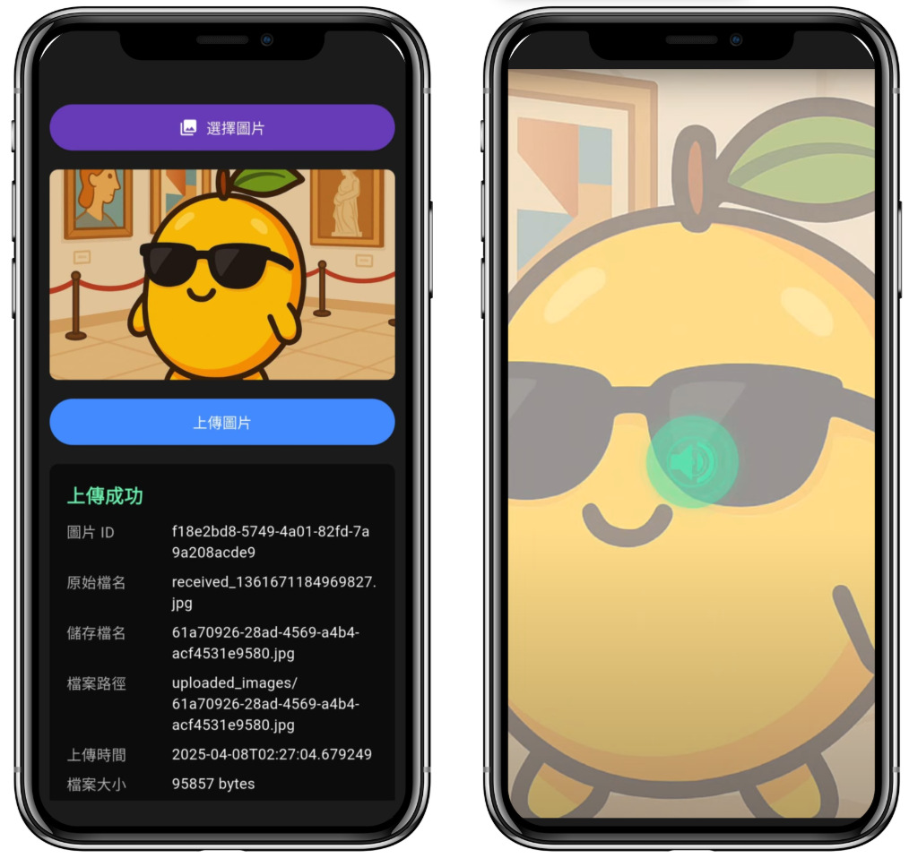

# Vision Bridge

#### A Visionary Art Interpretation LLM App for the Blind.  


> **For a more detailed development process and API design, please refer to [MangoJump](https://github.com/allen3325/Vision-Bridge-Backend).**

## Overview

Vision Bridge is a Flutter application designed to provide visually impaired users with an innovative way to interpret and experience art through AI-powered tools. The app leverages machine learning models and Flutter's cross-platform capabilities to deliver a seamless user experience.

## Features

- **AI-Powered Art Interpretation**: Uses advanced machine learning models to describe and interpret art.
- **Cross-Platform Support**: Runs on Android, iOS, Windows, macOS, Linux, and Web.
- **Accessibility First**: Designed with accessibility in mind, including screen reader support.

## Getting Started

### Prerequisites

- [Flutter SDK](https://docs.flutter.dev/get-started/install) (version 3.0.0 or higher)
- Dart 2.17.0 or higher
- Android Studio or Visual Studio Code (recommended for development)

### Installation

1. Clone the repository:
   ```bash
   git clone https://github.com/IdONTKnowCHEK/Vision-Bridge
   cd vision-bridge
   ```

2. Install dependencies:
   ```bash
   flutter pub get
   ```

3. Run the app:
   ```bash
   flutter run
   ```

### Directory Structure

```
lib/
├── main.dart         # Entry point of the application
├── screens/          # UI screens
├── components/          # Reusable widgets
├── models/           # Data models
├── services/         # Business logic and API integrations
├── utils/            # Utility functions and constants
```

## Configuration

### Assets

Add your assets (e.g., images, audio files) to the `assets/` directory and register them in `pubspec.yaml`:

```yaml
flutter:
  assets:
    - assets/images/
    - assets/audios/
```

## Dependencies

The project uses the following Flutter packages:

- `provider`: State management
- `http`: API requests
- `path_provider`: File system paths
- `permission_handler`: Permission management
- `nfc_manager`: NFC functionality

For a full list of dependencies, see the [pubspec.yaml](pubspec.yaml) file.
